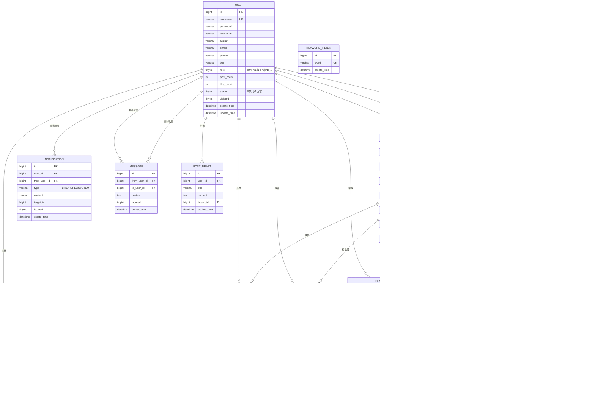

# 龙坛 ER 图

```mermaid
erDiagram
    USER ||--o{ POST : "发帖"
    USER ||--o{ REPLY : "回复"
    USER ||--o{ POST_LIKE : "点赞"
    USER ||--o{ REPLY_LIKE : "点赞"
    USER ||--o{ POST_FAVORITE : "收藏"
    USER ||--o{ POST_REPORT : "举报"
    USER ||--o{ NOTIFICATION : "接收通知"
    USER ||--o{ MESSAGE : "发送私信"
    USER ||--o{ MESSAGE : "接收私信"
    USER ||--o{ POST_DRAFT : "草稿"
    USER ||--o| BOARD : "管理版块"
    POST ||--o{ REPLY : "回复"
    POST ||--o{ POST_LIKE : "被赞"
    POST ||--o{ POST_FAVORITE : "被收藏"
    POST ||--o{ POST_REPORT : "被举报"
    POST }|--|| BOARD : "属于"
    REPLY ||--o{ REPLY_LIKE : "被赞"

    USER {
        bigint id PK
        varchar username UK
        varchar password
        varchar nickname
        varchar avatar
        varchar email
        varchar phone
        varchar bio
        tinyint role "0用户/1版主/2管理员"
        int post_count
        int like_count
        tinyint status "0禁用/1正常"
        tinyint deleted
        datetime create_time
        datetime update_time
    }

    BOARD {
        bigint id PK
        varchar name
        varchar description
        varchar icon
        int sort_order
        int post_count
        tinyint status "0待审/1通过/2拒绝"
        bigint moderator_id FK
        tinyint deleted
        datetime create_time
        datetime update_time
    }

    POST {
        bigint id PK
        varchar title
        text content
        bigint user_id FK
        bigint board_id FK
        int view_count
        int like_count
        int reply_count
        tinyint is_top
        tinyint is_hot
        tinyint status "0待审/1通过/2拒绝"
        tinyint deleted
        datetime create_time
        datetime update_time
    }

    REPLY {
        bigint id PK
        text content
        bigint post_id FK
        bigint user_id FK
        bigint parent_id FK
        int like_count
        tinyint status
        tinyint deleted
        datetime create_time
        datetime update_time
    }

    POST_LIKE {
        bigint id PK
        bigint user_id FK
        bigint post_id FK
        datetime create_time
    }

    REPLY_LIKE {
        bigint id PK
        bigint user_id FK
        bigint reply_id FK
        datetime create_time
    }

    POST_FAVORITE {
        bigint id PK
        bigint user_id FK
        bigint post_id FK
        datetime create_time
    }

    POST_REPORT {
        bigint id PK
        bigint post_id FK
        bigint user_id FK
        varchar reason
        tinyint status "0待处理/1已处理/2已驳回"
        datetime create_time
    }

    NOTIFICATION {
        bigint id PK
        bigint user_id FK
        bigint from_user_id FK
        varchar type "LIKE/REPLY/SYSTEM"
        varchar content
        bigint target_id
        tinyint is_read
        datetime create_time
    }

    MESSAGE {
        bigint id PK
        bigint from_user_id FK
        bigint to_user_id FK
        text content
        tinyint is_read
        datetime create_time
    }

    POST_DRAFT {
        bigint id PK
        bigint user_id FK
        varchar title
        text content
        bigint board_id FK
        datetime update_time
    }

    KEYWORD_FILTER {
        bigint id PK
        varchar word UK
        datetime create_time
    }
```
